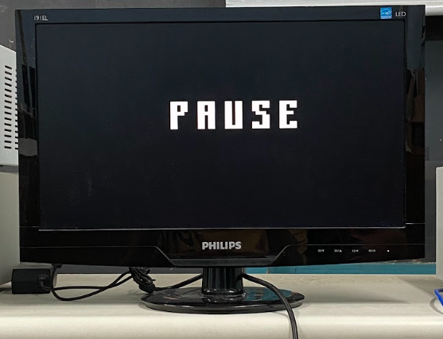
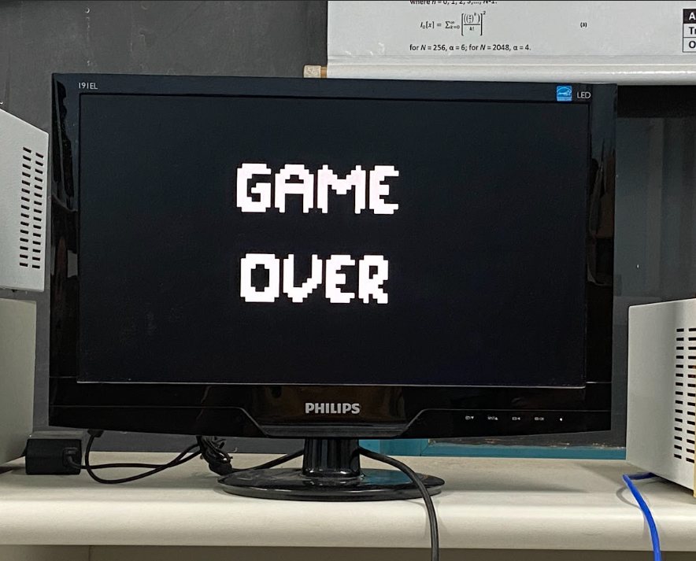
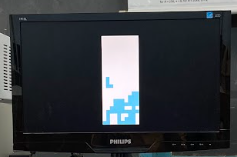

  

# Projeto da disciplina TEC 499 - Sistemas Digitais 

**Problema II - TEC499 - MI Sistemas Digitais - 2024.2**

 

[**SOBRE**](#sobre-o-projeto) • [**CARACTERÍSTICAS**](#características-do-projeto) • [**REQUISITOS**](#requisitos) • [**HARDWARE**](#hardware-utilizado) • [**SOFTWARE**](#software-utilizado) • [**DESENVOLVIMENTO**](#desenvolvimento-e-execução-do-projeto) • [**FUNCIONAMENTO**](#funcionamento-do-jogo) • [**SOLUÇÃO**](#solução-do-jogo) • [**BIBLIOTECAS**](#bibliotecas-utilizadas)  • [**CONCLUSÃO**](#conclusão) • [**EXECUÇÃO**](#execução-do-projeto) • [**DESENVOLVEDORES**](#desenvolvedores)

## SOBRE O PROJETO

 

O objetivo geral do projeto é implementar uma biblioteca em assembly contendo funções gráficas para facilitar a implementação do jogo Tetris em C e exibir o jogo em um monitor VGA utilizando a interface de conexão entre HPS e FPGA da DE1-SoC.
## CARACTERÍSTICAS DO PROJETO

- **Linguagem**: C e Assembly 
- **Plataforma**: DE1-SoC (com FPGA Cyclone V)
- **Controle de Jogo**: Acelerômetro ADXL-345
- **Saída de Vídeo**: Conexão VGA

## REQUISITOS

 

1. O código da biblioteca deve ser escrito em linguagem aseembly.
2. A biblioteca deve conter as funções essenciais para que seja possível implementar
a parte gráfica do jogo usando o Processador Gráfico.
3. A biblioteca deve seguir as recomendações descritas em:
https://github.com/MaJerle/c-code-style.

## HARDWARE UTILIZADO

 

**kit de desenvolvimento DE1-SoC**

A placa DE1-SoC é um kit de desenvolvimento que combina um processador ARM Cortex-A9 dual-core com um FPGA Cyclone V da Intel. Sendo ideal para o desenvolvimento de projetos de prototipagem e desenvolvimento de sistemas embarcados. A execução do jogo é acessada por meio de uma conexão SSH (via Ethernet) através do terminal de um computador.

**Acelerômetro ADXL345**

O ADXL345 é um acelerômetro digital de baixa potência e alta resolução, projetado para medir aceleração em três eixos (X, Y e Z). Ele pode detectar acelerações de até ±16g com uma precisão de 13 bits e é amplamente usado em dispositivos portáteis, sistemas de navegação, sensores de inclinação, e várias aplicações em robótica e sistemas embarcados.

**GPU**

A GPU desenvolvida por Gabriel Sá Barreto utiliza uma arquitetura personalizada em FPGA (Field-Programmable Gate Array) para facilitar a criação de jogos 2D. A arquitetura é baseada em sprites, que são pequenos blocos gráficos que representam os elementos do jogo, como personagens, obstáculos e outros objetos visuais. Ela é projetada para renderizar imagens em tempo real em um padrão VGA, com resolução de 640x480 pixels e taxa de atualização de 60 quadros por segundo, permitindo gráficos fluídos e responsivos.

Essa GPU é composta por vários componentes integrados que trabalham de forma coordenada para processar gráficos de forma eficiente. O processador principal, Nios II, é um processador softcore da Altera que executa o código do jogo escrito em C. Ele interage com o processador gráfico dedicado, enviando instruções para movimentação e atualização dos sprites na tela. As instruções são armazenadas em FIFOs (First In First Out), que ajudam a sincronizar as operações entre o processador principal e o processador gráfico.

A arquitetura também inclui um controlador VGA, responsável por sincronizar os sinais de vídeo para a renderização na tela. O processador gráfico realiza a renderização dos sprites com base nas instruções recebidas, o que inclui movimentação, alteração de layout e renderização de polígonos básicos, como quadrados e triângulos. Essas operações são feitas em tempo real, e o sistema de memória de sprites permite armazenar até 32 sprites de 20x20 pixels, que são atualizados automaticamente sem intervenção do software, agilizando o processamento gráfico.

Além disso, há um co-processador integrado que usa uma estrutura de pipeline para otimizar a construção de polígonos convexos, como quadrados e triângulos. Ele calcula a posição dos pixels que formam esses polígonos e usa um sistema de prioridade para lidar com sobreposições. Esse co-processador trabalha a uma frequência de 100MHz, processando instruções em paralelo para garantir que cada pixel seja atualizado a tempo para o próximo quadro, permitindo gráficos mais complexos sem comprometer a performance.

A GPU também oferece uma API simplificada para facilitar o desenvolvimento dos jogos, disponibilizando funções para definir e controlar sprites e o background. Essa API permite que desenvolvedores programem movimentações e detectem colisões entre sprites, facilitando a criação de jogos bidimensionais. Essa estrutura foi validada com a criação de jogos clássicos como *Asteroids* e *Space Invaders*, o que demonstrou a capacidade da arquitetura em suportar jogos 2D interativos com elementos móveis e gráficos em tempo real.

## SOFTWARE UTILIZADO

 

**Linguagem C**

A linguagem C foi escolhida por sua eficiência, portabilidade e grande popularidade em sistemas embarcados. Sua sintaxe clara oferece controle direto sobre o hardware, ao mesmo tempo em que suas bibliotecas padrão e ferramentas possibilitam o desenvolvimento de código compacto e otimizado para dispositivos com restrições de recursos.

**Linguagem Assembly**

Assembly é a linguagem de programação de mais baixo nível,  que fornece um mapeamento direto das instruções. No problema foi utilizado o assembly desenvolvido para a arquitetura ARMv7.

**Compilador GNU**

O Compilador GNU (GCC - GNU Compiler Collection) é uma coleção de compiladores de código aberto que faz parte do projeto GNU, sendo amplamente utilizado para compilar programas em várias linguagens de programação, como C, C++, Fortran, Ada e outras. Ele é um dos compiladores mais populares e é essencial no desenvolvimento de software livre e projetos baseados em Linux.

**VSCODE**

O Visual Studio Code (VSCode) é um editor de código-fonte leve, desenvolvido pela Microsoft, que oferece uma ampla gama de funcionalidades para programadores. Ele é gratuito, de código aberto e disponível para várias plataformas, incluindo Windows, macOS e Linux.

## DESENVOLVIMENTO E EXECUÇÃO DO PROJETO

 

**Acelerômetro, Mapeamento de Memória e I2C**

O acelerômetro utilizado no jogo é um dispositivo ADXL345, que se comunica via o barramento I2C (Inter-Integrated Circuit). Para acessá-lo, o código implementa o mapeamento de memória e manipulação direta de registradores. Mapeamento de Memória: O sistema Linux oferece um dispositivo especial chamado /dev/mem, que permite que processos de usuário acessem endereços físicos de hardware. O código usa o mapeamento de memória através da função mmap(), transformando os registradores do controlador I2C em ponteiros acessíveis pelo programa. Isso permite a leitura e escrita direta nos registradores de controle do barramento I2C. Comunicação I2C: Após o mapeamento, as funções implementadas permitem a leitura e escrita nos registradores do acelerômetro. Para isso, a inicialização do controlador I2C é feita com a função I2C0_Init(), que configura o dispositivo para o modo mestre e define o endereço do acelerômetro. Funções como accelerometer_x_read() são usadas para capturar os valores do eixo X do acelerômetro, enquanto accelerometer_isDataReady() verifica se os dados estão prontos para leitura. Função no Jogo: O acelerômetro detecta a inclinação do dispositivo, e com base nesses valores, o jogo move as peças para a esquerda ou direita no tabuleiro, conforme os movimentos do jogador. Isso adiciona uma camada de interatividade física ao jogo.

**Threads**

O jogo faz uso de threads para permitir a execução de tarefas concorrentes. Duas threads são criadas para gerenciar a leitura contínua do acelerômetro e o monitoramento dos botões do dispositivo. Thread do Acelerômetro: A função accel_working() é executada em uma thread separada. Essa thread continuamente verifica se há novos dados no acelerômetro e, se houver, lê os valores do eixo X para determinar se a peça deve se mover para a esquerda ou direita no tabuleiro. O uso de usleep() controla a frequência de leitura para evitar sobrecarga de processamento. Thread dos Botões: A função button_threads() também é executada em uma thread separada, que monitora o estado dos botões do hardware. Os botões têm diferentes funcionalidades: um deles pausa e retoma o jogo, e outro termina o jogo. Isso é feito através de uma leitura contínua dos botões usando a biblioteca KEY_read(), onde os eventos de pressionamento dos botões disparam as ações correspondentes no jogo. Sincronização com o Jogo: As threads permitem que o jogo continue a rodar independentemente, enquanto as entradas de controle (acelerômetro e botões) são monitoradas em segundo plano. Isso garante que a interação seja fluida e sem interrupções na lógica principal do jogo.

**Biblioteca de vídeo**

A biblioteca de vídeo desenvolvida em assembly para ARM Cortex-A9 utiliza conceitos de baixo nível para maximizar o desempenho gráfico em dispositivos que operam com recursos limitados. A arquitetura de GPU de Gabriel Sá Barreto oferece uma infraestrutura de suporte à manipulação eficiente de gráficos, complementada por uma API simplificada que facilita a criação e atualização de sprites e o controle de background. Cada função da biblioteca é projetada para interagir diretamente com o hardware, otimizando a velocidade de execução e reduzindo a latência na atualização dos frames.

mem:

Função de manipulação de memória que gerencia a alocação e controle de dados gráficos, como cores de pixels e dados de sprites. Essa função é responsável por armazenar e recuperar informações diretamente da memória, onde os gráficos são processados. Ao lidar com registradores e endereços de memória, a função mem permite acesso direto ao armazenamento dos dados que compõem o display, o que é crucial para otimizar a renderização gráfica.
set_sprite:

Configura a posição de um sprite na tela, definindo suas coordenadas X e Y, seu offset de memória (para identificar o sprite na memória gráfica) e o bit de ativação. A set_sprite utiliza registradores para aplicar rapidamente essas informações, o que possibilita a movimentação dos sprites em tempo real sem impactar o desempenho. Essa função é essencial para controlar personagens e objetos móveis dentro do jogo.
set_dp:

A função set_dp configura o ponto de referência de um polígono, definindo sua posição na tela e outras propriedades, como cor e forma (triângulo ou quadrado). Utilizando o co-processador da GPU, essa função otimiza o processamento de polígonos para que cada elemento gráfico tenha uma orientação e posição específicas, gerando gráficos nítidos e atualizados a cada quadro.
set_background_block:

Define a cor de blocos específicos do background (fundo), segmentados em uma grade de 8x8 pixels, preenchendo cada bloco com valores RGB. Esse método permite personalizar o cenário de forma modular, alterando apenas seções específicas do fundo, o que facilita a criação de cenários complexos sem a necessidade de redesenhar toda a tela.
display_7seg:

A função display_7seg gerencia a exibição de valores numéricos em um display de 7 segmentos, comumente usado para mostrar pontuações, vidas restantes ou temporizadores. A função converte os valores em números visíveis no display, que é sincronizado com o estado atual do jogo. A interação direta com o hardware permite uma atualização rápida e precisa, melhorando a interatividade visual.
push_button:

Gerencia as entradas de botões físicos, capturando os sinais de pressão e associando-os a ações específicas no jogo, como saltar, atirar ou mover. Essa função lê o estado de cada botão e, ao ser acionado, dispara as operações correspondentes, permitindo que os jogadores controlem diretamente os elementos da interface de maneira precisa e com baixa latência.
wrregfull:

A função wrregfull verifica se as FIFOs (First In, First Out) usadas para armazenar instruções estão cheias, evitando sobrecargas e erros de dados. Ela garante que as instruções sejam processadas na ordem correta e sem perda, essencial para a renderização contínua e estável dos gráficos. Esse controle de fluxo é fundamental para manter o desempenho do sistema gráfico e garantir a integridade dos dados visuais.
Essas funções, projetadas para o ARMv7 Cortex-A9, atuam em conjunto com o co-processador gráfico, aproveitando pipelines e manipulação direta de registradores. Essa abordagem assegura um processamento gráfico eficiente, adequado para aplicações de jogos que demandam renderização rápida e responsiva.

**Tabuleiro e Peças no VGA**

O jogo exibe o tabuleiro e as peças na tela usando um controlador VGA (Video Graphics Array). Tabuleiro: O tabuleiro é uma matriz bidimensional (int board[ROWS][COLS]) que representa as células onde as peças caem. A função initBoard() inicializa essa matriz, e cada célula pode estar vazia ou ocupada por parte de uma peça. O tabuleiro é renderizado na tela a cada iteração do loop principal do jogo, sendo atualizado conforme as peças se movem ou são fixadas. Peças: As peças do jogo são representadas por structs que contêm suas formas e posições. A função getRandomPiece() seleciona aleatoriamente uma nova peça para cair. A peça atual é renderizada na posição adequada no tabuleiro com a função renderWithPiece(), que combina o estado do tabuleiro com a peça ativa. Exibição VGA: A comunicação com a tela VGA é feita através de um processador gráfico desenvolvido pelo estudante Gabriel Sá Barreto. As funções background_block, draw_square, clear_screen e bg_color são responsáveis por gerenciar a exibição gráfica. A tela é constantemente limpa e redesenhada a cada ciclo do jogo para refletir o estado atual do tabuleiro, a peça em queda e outras informações. Pontuação e Fim de Jogo: A pontuação é exibida no display de 7-segmentos presente no kit de desenvolvimento DE1-SoC. A cada vez que uma linha do tabuleiro é completada, ela é removida e a pontuação é atualizada usando a função clearLines(). Quando o jogo termina (se a peça alcançar o topo do tabuleiro), a mensagem "GAME OVER" é exibida e o jogo é finalizado. O trabalho de conclusão de curso de Gabriel Sá por ser acessado em:
https://drive.google.com/file/d/1MlIlpB9TSnoPGEMkocr36EH9-CFz8psO/view

## FUNCIONAMENTO DO JOGO

 

As peças são formadas por quatro blocos quadrados. Existem sete formas básicas de peças, cada uma com uma letra correspondente.

**Início:**

O jogo é iniciado em um tabuleiro que consiste em uma grade retangular (10 colunas x 20 linhas), o jogo começa com um espaço vazio e, gradualmente, os tetriminos começam a cair do topo da tela.

**Mecânica de Jogo:**

As peças caem de uma posição inicial no topo do tabuleiro e continuam descendo até tocarem a linha mais baixa ou outra peça já posicionada. O diferencial na jogabilidade é o uso de um acelerômetro: ao inclinar a placa, o jogador pode mover as peças para a esquerda ou direita. O acelerômetro detecta o grau de inclinação, e, conforme os dados de inclinação são lidos, o movimento da peça no tabuleiro é ajustado.

Esse controle intuitivo permite que, inclinando a placa para a direita, a peça se mova para a direita no tabuleiro, enquanto inclinações para a esquerda fazem a peça se deslocar para a esquerda. A precisão do acelerômetro faz com que o jogador tenha controle direto sobre o posicionamento das peças em tempo real, influenciando a estratégia de encaixe nas lacunas.

Quando uma linha é completamente preenchida com blocos, ela desaparece, e as linhas acima descem uma posição, gerando pontos. O jogador ganha pontos ao remover linhas, e a habilidade de controlar a movimentação das peças com a inclinação da placa cria uma experiência de jogo mais dinâmica e interativa.

**Objetivo:**

O jogo tem como objetivo fazer a maior pontuação possível sem que as peças atinjam o topo do tabuleiro.

**Pausa e retomada**

Botão de Pausa: Quando o jogador pressiona o botão correspondente, o jogo é pausado. Durante a pausa, o jogador não pode mover as peças, e uma mensagem indicando o estado de pausa aparece na tela. Pressionar o botão novamente retoma o jogo. Botão de Retomar: Esse botão é usado para retornar ao jogo após ele ter sido pausado. Ele faz com que o jogo volte à sua dinâmica normal, permitindo o controle das peças e a continuidade da partida. Botão de Encerramento: Pressionar este botão encerra o jogo imediatamente, interrompendo qualquer ação em andamento e levando ao fim da partida.

## SOLUÇÃO DO JOGO

 

A implementação apresentada demonstra a capacidade de atender integralmente aos requisitos propostos. Preliminarmente ao laço principal de execução, é realizada uma verificação para confirmar o desejo do usuário em iniciar o jogo. Em seguida, são inicializados os periféricos necessários para o funcionamento do sistema, a saber: interface gráfica (VGA), acelerômetro e botões de controle. Na sequência, são instanciados os elementos essenciais para o jogo, o mecanismo de geração aleatória de peças e as threads responsáveis pela execução concorrente das diferentes funcionalidades do sistema. Dentro do laço principal, o sistema realiza a leitura contínua dos dados provenientes do acelerômetro e verifica a ocorrência de eventos de clique nos botões. Na ausência de eventos de clique, a execução do jogo prossegue normalmente. Os dados obtidos do acelerômetro são utilizados para determinar a movimentação da peça em jogo, que é atualizada de acordo com os valores capturados. Após a atualização da posição da peça, é verificada a ocorrência de colisões com outras peças ou com as bordas do tabuleiro. Caso ocorra uma colisão, a peça é fixada na posição atual, sendo incorporada à matriz principal. Em seguida, é realizada uma verificação para determinar se o jogo chegou ao fim, condição que ocorre quando a pilha de peças atinge o topo do tabuleiro. Caso o jogo não tenha terminado, é verificada a ocorrência de eventos de clique nos botões, sendo executada a ação correspondente a cada botão pressionado. Ao final do jogo, é exibida a mensagem "GAME OVER!" na tela.

## BIBLIOTECAS UTILIZADAS

 

Nesta seção, serão abordadas as principais bibliotecas essenciais para o funcionamento completo do Tetris.

**sys/mman**

O uso de mmap é fundamental para acessar o acelerômetro na DE1-SoC, pois permite mapear o endereço físico do hardware (como o controlador I2C do acelerômetro) diretamente no espaço de memória do processo. Isso facilita a leitura e escrita de registradores do acelerômetro sem a necessidade de chamadas de sistema frequentes, reduzindo a latência e permitindo acesso direto e eficiente ao dispositivo.

**pthread**

A biblioteca pthread é crucial para integrar a leitura dos dados do acelerômetro ao loop principal do tetris, permitindo que ambos funcionem de maneira paralela. Ao criar duas threads principais — uma para a leitura contínua dos dados do acelerômetro e outra para o loop principal do jogo — é possível evitar que a leitura dos sensores bloqueie ou atrase a execução do jogo. A thread dedicada ao acelerômetro interpreta os valores de inclinação para mover as peças do Tetris (esquerda, direita) sem interferir na renderização ou na lógica do jogo. Simultaneamente, a thread do loop principal mantém o fluxo do jogo, verificando colisões, atualizando o estado da tela VGA e respondendo rapidamente às ações do jogador. A sincronização entre as threads, usando mutexes ou variáveis de condição, garante que a comunicação seja correta e sem inconsistências.

**Biblioteca desenvolvida pela equipe em assembly**

A biblioteca desenvolvida é cruicial para exibir no monitor o jogo. Contém diversas funções responsáveis por realizar o mapeamento da memória, a exibição de blocos no background, a troca de cor do background, além da exibição de sprites.

## RESULTADOS

**Tela inicial**

 

  

**Tela de pausa**

 

  

**Tela de Game over**

 

  

**Jogo em funcionamento**

  
  

    
  

  

    <em><a href="https://www.youtube.com/shorts/PCnSJu0J768">Assista ao vídeo de demonstração</a></em>
  

## CONCLUSÃO

A presente implementação do clássico jogo Tetris, desenvolvida em linguagem C para a plataforma DE1-SoC, demonstra a viabilidade e eficácia da utilização de sistemas embarcados em aplicações de entretenimento. A arquitetura da placa DE1-SoC, aliada a drivers disponíveis e ao processador gráfico desenvolvido pelo estudante Gabriel Sá Barreto , proporcionou o ambiente ideal para o desenvolvimento e execução do jogo, atendendo integralmente aos requisitos propostos. A integração entre o software e o hardware da plataforma permitiu a utilização coordenada de diversos periféricos, como a interface VGA para a renderização gráfica, o acelerômetro para a interação por movimento e os botões para o controle tradicional do jogo. Os testes realizados demonstraram a estabilidade e o desempenho satisfatório do sistema, garantindo a execução confiável do jogo em diferentes cenários. A arquitetura ARMv7 da plataforma DE1-SoC, em conjunto com a linguagem C, proporcionou um ambiente de desenvolvimento eficiente, permitindo a implementação de algoritmos para a execução. Além de cumprir os objetivos específicos do projeto, a implementação do Tetris em plataforma DE1-SoC contribuiu significativamente para o desenvolvimento das competências dos envolvidos, aprofundando os conhecimentos em sistemas embarcados, arquitetura ARMv7 e programação em linguagem C. A experiência adquirida neste projeto abre novas perspectivas para o desenvolvimento de sistemas digitais mais complexos e a criação de soluções inovadoras em diversos setores.

## EXECUÇÃO DO PROJETO

 

Siga os passos abaixo para baixar, compilar e executar o código do projeto em um dispositivo FPGA DE1-SoC.

**Passo 1: Clonar o Repositório Abra o terminal e execute o comando a seguir para clonar o repositório com o código-fonte:**

    git clone https://github.com/GHenryssg/PBL---SD.git

**Passo 2: Navegar até o Diretório e Compilar**
Após clonar o repositório, entre no diretório do projeto com o comando

    cd TEC499-GPU-LIB

**Passo 3: Em seguida, compile e execute o código utilizando o comando:**

    make

## DESENVOLVEDORES

  

<table>
  <tr>
    <td align="center"> <b> Gabriel Henry </b></a> 👨‍💻</a></td>
    <td align="center"> <b> Ilson Neto </b></a> 👨‍💻</a></td>
    <td align="center"> <b> Carlos Arthur </b></a> 👨‍💻</a></td>
    <td align="center"> <b> Luis Guilherme </b></a> 👨‍💻</a></td>
  </tr>
</table>

#### [Voltar ao topo](#projeto-da-disciplina-tec499-sistemas-digitais)

  
